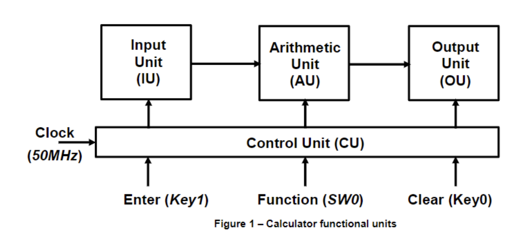

# 🧮 8-Bit Four-Function Calculator - FPGA Implementation

## 📌 Project Overview
The **8-Bit Four-Function Calculator** is an FPGA-based calculator that performs **addition, subtraction, multiplication,** and **division**. This project is implemented on the **Terasic DE10-Lite FPGA** using **SystemVerilog HDL**. The calculator integrates the **Control Unit (CU)** with the **Arithmetic Unit (AU)**, **Input Unit (IU)**, and **Output Unit (OU)**. 

With this setup, the calculator:
- **Captures operands** from the keypad
- **Displays results** on a 7-segment display
- **Performs basic arithmetic operations** (ADD, SUBTRACT, MULTIPLY, DIVIDE)
- Handles **sign-magnitude decimal input** and displays results accordingly

  

---

## 🎯 Project Requirements
This project implements a **4-function calculator** that operates on an **8-bit** decimal number system. The key components and functionality include:

- **Inputs**: Entered using the **4x4 Keypad**
- **Operations**: ADD, SUBTRACT, MULTIPLY, DIVIDE
- **Display**: Results and operands shown on the **DE10 seven-segment displays (HEX3, HEX2, HEX1, HEX0)**
- **Overflow indication**: LEDR9 lights up for overflow conditions
- **Clear**: Full reset (Key0) and individual operand reset (Key1)

### 🔍 **Key Objectives:**
- Design and implement a functional calculator system
- Integrate the **Control Unit (CU)** with **Arithmetic Unit (AU)**, **Input Unit (IU)**, and **Output Unit (OU)**
- Ensure correct input handling (sign-magnitude) and accurate display of results
- Validate the design using the **Terasic DE10-Lite FPGA**

---

## ⚙️ System Design
The calculator system is designed to handle basic arithmetic operations and ensure smooth data flow between components. Here’s a breakdown of the main units:

### 🔹 **Control Unit (CU)**
The **CU** generates control signals for the entire system based on the user input. It operates as a **finite-state machine (FSM)** to orchestrate the sequence of events.

### 🔹 **Arithmetic Unit (AU)**
The **AU** performs the core arithmetic operations:
- **ADD**
- **SUBTRACT**
- **MULTIPLY**
- **DIVIDE**

### 🔹 **Input Unit (IU)**
User inputs are captured via the **4x4 Keypad**. The input is in **sign-magnitude** decimal form, and it handles both non-negative and negative numbers.

### 🔹 **Output Unit (OU)**
The results are displayed on the **DE10 seven-segment displays**. The output formatting includes:
- **Non-negative numbers**: Displayed without sign and leading zeros
- **Negative numbers**: Displayed with a minus sign (-) and appropriate magnitude
- **Overflow**: Indicated by lighting **LEDR9**

  

  

<b>Figure 1: Organization Diagram of the Calculator System</b>

---

## 🛠️ Features & Requirements

### 🔹 **Input Handling**  
- **Clear Calculator**: Press **Key0** to reset the system
- **Operand A**: Entered using the Keypad, followed by pressing **A, B, C, or D** to indicate the operation (Add, Subtract, Multiply, Divide)
- **Operand B**: Entered using the Keypad
- **Start Operation**: Press **#** to trigger the operation

### 🔹 **Display Requirements**  
- **Operand Entry**: Displayed in **sign-magnitude decimal** on the 7-segment displays
- **Results**: Also shown in **sign-magnitude decimal**, with negative results prefixed by a minus sign
- **Overflow**: Displayed by lighting **LEDR9**

---

## 📊 Test Results

The calculator was tested using various sets of input values, including edge cases such as overflow and invalid inputs.

### Summary of Test Results:
- **Valid Operations**: Correct results for addition, subtraction, multiplication, and division
- **Overflow Handling**: LEDR9 successfully lit up for operations resulting in overflow
- **Invalid Input**: The system displayed **[Er]** for invalid inputs, demonstrating error handling functionality

  

  

<b>Figure 2: Testing Results on DE10-Lite FPGA Board</b>

---

## 🔧 How to Use

### 🛠️ Requirements
- **Intel Quartus Prime (Lite or Standard)**
- **Terasic DE10-Lite FPGA Board**
- **USB-Blaster for FPGA Programming**
- **SystemVerilog (for design implementation)**

### 📝 Usage Instructions
1. Press **Key0** to clear the calculator.
2. Enter **Operand A** using the Keypad.
3. Select the operation (ADD, SUBTRACT, MULTIPLY, DIVIDE) by pressing **A, B, C, or D**.
4. Enter **Operand B** using the Keypad.
5. Press **#** to perform the operation and display the result.
6. Press **Key1** to clear the current entry.

---

## 📂 Project Report

For a detailed breakdown of the project, including design methodologies, implementation details, and test results, refer to the full project report:

📄 **[8-Bit Calculator Project Report](docs/Calculator_Project_Report.pdf)**

---

## 🔮 Future Improvements

✅ Expand operation set (e.g., power, modulo)  
✅ Implement support for floating-point numbers  
✅ Add more complex error handling for input validation  
✅ Optimize design for better performance

